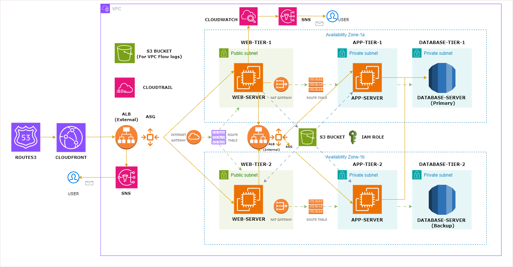

# Three-Tier Web Application Architecture on AWS

## Overview

This project demonstrates the design and deployment of a highly available, scalable, and secure three-tier web application architecture on Amazon Web Services (AWS).

The infrastructure is built using AWS networking, compute, database, monitoring, and security services. The application is distributed across multiple Availability Zones to ensure fault tolerance, improved availability, and better performance.

---

## Architecture Diagram

---

## Architecture Components

### Web Tier

* Amazon EC2 instances running Nginx and React.js.
* Public-facing Application Load Balancer (ALB).
* Auto Scaling Group for automatic scaling and high availability.
* Deployed in public subnets across multiple Availability Zones.

### Application Tier

* Node.js backend application.
* Internal Application Load Balancer for secure communication.
* Auto Scaling Group for handling workload fluctuations.
* Deployed in private subnets.

### Database Tier

* Amazon RDS Aurora MySQL.
* Multi-AZ deployment for high availability.
* Database instances deployed in private subnets.
* Accessible only from the application layer.

### Networking Components

* Custom VPC
* Public and Private Subnets
* Internet Gateway
* NAT Gateway
* Route Tables
* Security Groups

### Monitoring & Security

* Amazon CloudWatch
* Amazon SNS
* AWS CloudTrail
* VPC Flow Logs
* IAM Roles and Policies

### DNS & Content Delivery

* Amazon Route 53
* Amazon CloudFront

---

## AWS Services Used

| Service      | Purpose                  |
| ------------ | ------------------------ |
| EC2          | Application Hosting      |
| VPC          | Network Isolation        |
| ALB          | Traffic Distribution     |
| Auto Scaling | Automatic Scaling        |
| RDS Aurora   | Managed Database         |
| S3           | Code Storage & Flow Logs |
| IAM          | Access Management        |
| CloudWatch   | Monitoring               |
| SNS          | Notifications            |
| CloudTrail   | Auditing                 |
| Route 53     | DNS Management           |
| CloudFront   | Content Delivery         |

---

## Project Implementation Steps

### 1. Source Code Preparation

* Download web and application source code.
* Upload application artifacts to Amazon S3.

### 2. Storage Configuration

* Created S3 bucket for application deployment packages.
* Created separate S3 bucket for VPC Flow Logs.

### 3. IAM Configuration

Created IAM Role with:

* AmazonSSMManagedInstanceCore
* S3 ReadOnly Access

### 4. Networking Setup

Configured:

* Custom VPC
* Public Subnets
* Private Subnets
* Internet Gateway
* NAT Gateway
* Route Tables
* VPC Flow Logs

### 5. Security Configuration

Created Security Groups for:

#### External Load Balancer

* HTTP (80) from Internet

#### Web Tier

* HTTP from External ALB

#### Internal Load Balancer

* HTTP from Web Tier

#### Application Tier

* Port 4000 from Internal ALB

#### Database Tier

* MySQL Port 3306 from Application Tier

### 6. Database Deployment

* Created Database Subnet Group.
* Deployed Aurora MySQL in Multi-AZ mode.
* Configured private connectivity.

### 7. Application Tier Deployment

* Launched EC2 instance for backend testing.
* Installed Node.js application.
* Configured database connectivity.
* Created custom AMI.
* Created Launch Template.
* Created Internal ALB.
* Created Target Group.
* Configured Auto Scaling Group.

### 8. Web Tier Deployment

* Launched EC2 instance.
* Installed Nginx.
* Configured React frontend.
* Updated nginx.conf with Internal ALB endpoint.
* Created custom AMI.
* Created Launch Template.
* Created External ALB.
* Created Target Group.
* Configured Auto Scaling Group.

### 9. DNS Configuration

* Registered application endpoint in Route 53.
* Mapped domain to External ALB.

### 10. Monitoring & Alerting

Configured:

* CloudWatch Metrics
* CloudWatch Alarms
* SNS Notifications

### 11. Auditing & Logging

Configured:

* AWS CloudTrail
* VPC Flow Logs
* Centralized Log Storage in S3

---

## Security Best Practices Implemented

* Multi-tier architecture isolation.
* Least privilege IAM access.
* Private database deployment.
* Private application layer.
* Security group based access control.
* VPC Flow Log monitoring.
* CloudTrail auditing enabled.
* Internal Load Balancer for backend communication.

---

## Key Features

✅ High Availability Architecture

✅ Multi-AZ Deployment

✅ Auto Scaling

✅ Application Load Balancing

✅ Secure Network Segmentation

✅ Monitoring & Alerting

✅ Centralized Logging

✅ Fault Tolerance

✅ Infrastructure Scalability

---

## Challenges Solved

* Secure communication between application layers.
* Database access restriction using Security Groups.
* Private subnet internet access through NAT Gateway.
* High availability across Availability Zones.
* Monitoring infrastructure health using CloudWatch.
* Automated scaling based on workload.

---

## Learning Outcomes

Through this project I gained practical experience with:

* AWS Networking
* EC2 Administration
* Load Balancers
* Auto Scaling Groups
* Aurora MySQL
* IAM & Security
* Monitoring & Logging
* Cloud Architecture Design
* High Availability Concepts
* Troubleshooting Production Workloads

---

## Future Improvements

* Infrastructure as Code using Terraform
* CI/CD Pipeline using Jenkins
* Docker Containerization
* Amazon EKS Deployment
* AWS WAF Integration
* SSL/TLS using ACM
* Blue-Green Deployments

---

## Author

Meet Dangar

DevOps & Cloud Engineering Enthusiast

AWS Cloud Practitioner Certified
